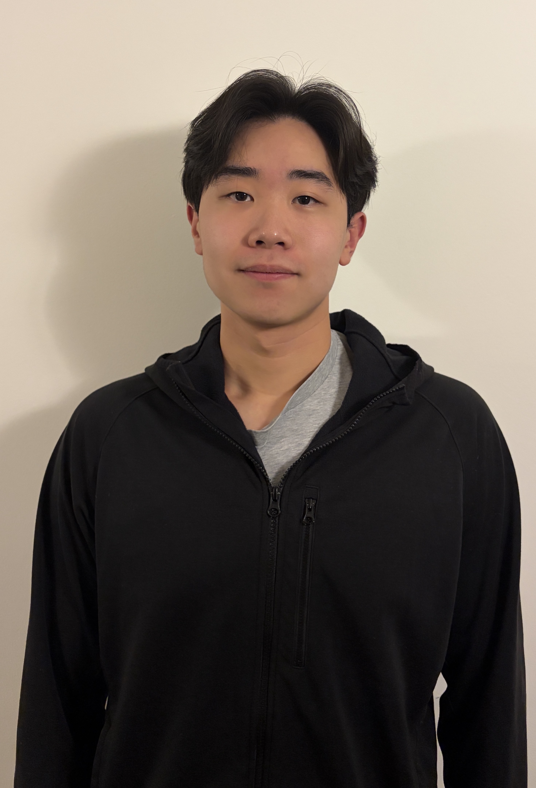

{width=250px}

My name is Barry and I just finished my Bachelors of Science in Biology from the University of British Columbia. I was born and raised in Vancouver, so I have been here basically all my life. 
Prior to entering UBC's Master of Data Science program I worked as a research assistant in an immunology lab that investigated the relationship between Epstein-Barr virus and multiple sclerosis. I am hoping to gain both foundational and technical data science skills from UBC's Master of Data Science, allowing me to expand my data science toolkit within the context of immunology. I look forward to meeting new people and learning as much as I can in the coming year! 

