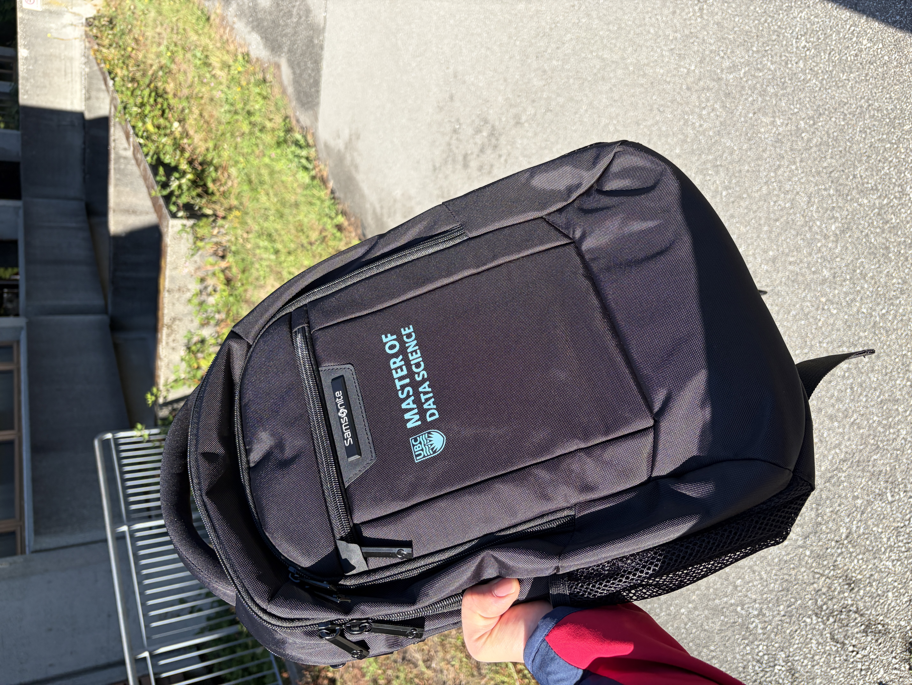

My first week's in MDS have been great! During orientation I met so many people from so many different backgrounds in both academia and industry. One of the most fun parts of orientation was the campus scavenger hunt, where we got to split into teams to complete challenges. We got to tour all parts of campus, and we even got a little prize at the end (refer to image below)!

In my first week of official MDS classes, I learned so much in such a short time, from working in the terminal, R, python, and positron to understanding statistics and probabilities. Overall the days were long, but I was able to get all my homework done before the weekend which gave me some time to rest. 

As I am entering pre-quiz week I am starting to feel a bit of the pressure but overall it has been a great few weeks, I was able to meet many people and make many friends from everywhere in the world!

